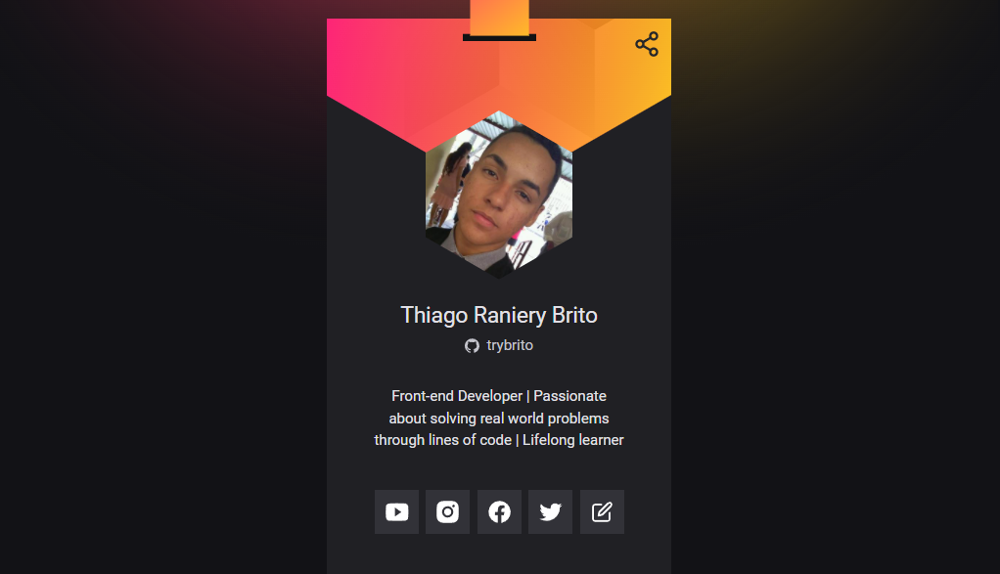

<div align="center">
  <div>
    <h1>SpecBadge</h1>
    <p>
      <a href="#-about-the-project">About the project</a> •
      <a href="#-status">Status</a> •
      <a href="#-features">Features</a> • 
      <a href="#%EF%B8%8F-prerequisites">Prerequisites</a> • 
      <a href="#-applied-technologies">Applied technologies</a> • 
      <a href="#-author">Author</a> •
      <a href="#-readme-versions">README versions</a>
    </p>
    
  </div>

  <div>
    
    
    
  </div>
</div>

<hr>

### 🎯 About the project

<p>
  Aiming at gathering personal information and facilitating the networking process at technology events, SpecBadge is, essentially, a platform for creating, viewing and customizing virtual spectator badges.
</p>

<hr>

### 🏁 Status

<h3 align="center">
  🎉 SpecBadge ✔️ Finished 🎉
</h3>

<hr>

### 🏆 Features

- [x] Implement responsive design;
- [x] Manage access to application routes according to the user's state, that is, whether authenticated or not;
- [x] Display custom error page for non-aplication routes;
- [x] Perform user social login with GitHub OAuth;
- [x] Save and retrieve, from the database, the access tokens of authenticated users, for persistent login implementation;
- [x] Search and display the user's GitHub account information, if the user is authenticated;
- [x] Edit and save the user's espectator badge informartion on the database;
- [x] Search and display specific information from the user's badge, that is, the name of the event in which he is participating and the links to his social medias;
- [x] Copy user badge URI to clipboard; and
- [x] Access, via URI, badges of other users.

<hr>

### ❗️ Prerequisites

Hey, Dev, before starting your tests and/or contributions in the application, it is necessary to have two things installed, the first one is our wonderful [GIT](https://git-scm.com), and the second, the [Node.js](https://nodejs.org/en/), in addition, of course, to a good text editor.

Well, with everything installed and ready, we can proceed to the step by step of how to run the application.

### 🕹️ Running the application

```bash
# First of all, clone this repo using GIT.
$ git clone <https://github.com/trybrito/specbadge>

# Access the project folder from the command terminal.
$ cd .../specbadge

# Install the package.json dependencies.
$ yarn / npm install

# Initialize the database.
$ yarn init-db

# Run the application server.
$ yarn server

# Compile your styles with the Tailwind CLI.
$ yarn watch

# And finally, access <http://localhost:3000> to see the application running on the local server.
```

<hr>

### 🔮 Applied technologies

#### General

- [JavaScript](https://devdocs.io/javaScript/)
- [Gulp](https://gulpjs.com/)

#### 💻 Frontend

- [EJS](https://ejs.co/)
- [Tailwind CSS](https://tailwindcss.com/)

#### ⚙️ Backend

- [Node.js](https://nodejs.org/en/)
- [Nodemon](https://www.npmjs.com/package/nodemon)
- [Express.js](https://expressjs.com/pt-br/)
- [MongoDB](https://docs.mongodb.com/drivers/node/current/)
- [Redis](https://redis.io/)
- [dotenv](https://www.npmjs.com/package/dotenv)
- [node-fetch](https://www.npmjs.com/package/node-fetch)
- [serialize-javascript](https://www.npmjs.com/package/serialize-javascript)
- [connect-mongo](https://www.npmjs.com/package/connect-mongo)
- [express-session](https://www.npmjs.com/package/express-session)
- [express-csp-header](https://www.npmjs.com/package/express-csp-header)

<hr>

### 👨🏽‍🎓 Author

<div align="center">
  

  <br />

  <div>
    <h3>
      🤝 Thiago Raniery Brito
    </h3>
    <p>
      Hey, Dev, did you like the app? Well, if you want, feel free to contribute to the project and/or get in touch with me through the platforms below, see you later!
    </p>
  </div>
  
  <div>
    <a href="https://www.linkedin.com/in/trybrito">
      </a>
    <a href="mailto:thiagobritotrs@gmail.com">
      </a>
  </div>
</div>

<hr>

### 📚 README versions

<div>
  <a href="https://github.com/trybrito/specbadge/blob/main/README.md">Portuguese (pt-br)</a>
  |
  <a href="https://github.com/trybrito/specbadge/blob/main/README-en.md">English (en-us)</a>
</div>
