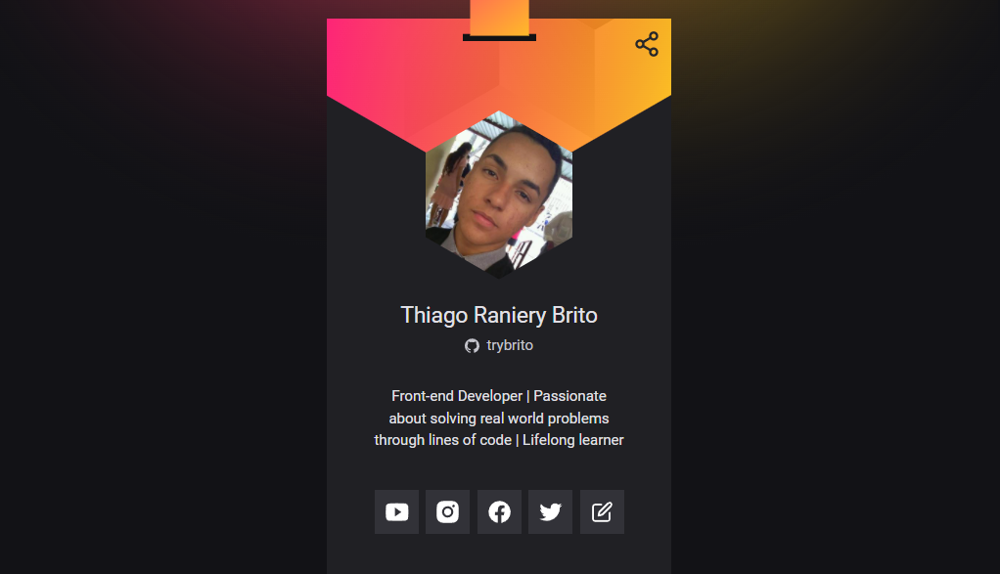

<div align="center">
  <div>
    <h1>SpecBadge</h1>
    
    <h3>
      🎫 Uma aplicação JavaScript Vanilla para criação, visualização e personalização de crachás virtuais de espectador
    </h3>
  </div>

  <p>
    <a href="#-sobre-o-projeto">Sobre o projeto</a> •
    <a href="#-status">Status</a> •
    <a href="#-features">Features</a> • 
    <a href="#%EF%B8%8F-pré-requisitos">Pré-requisitos</a> • 
    <a href="#-tecnologias-utilizadas">Tecnologias utilizadas</a> • 
    <a href="#-autor">Autor</a> •
    <a href="#-readme-versions">README versions</a>
  </p>

  <div>
    
    
    
  </div>
</div>

<hr>

### 🎯 Sobre o projeto

<p>
  Possuindo como objetivo o agrupamento de informações pessoais e a facilitação do processo de networking em eventos de tecnologia, a SpecBadge é, essencialmente, uma plataforma para criação, visualização e personalização de crachás virtuais de espectador.
</p>

<hr>

### 🏁 Status

<h3 align="center">
  🎉 SpecBadge ✔️ Finalizado 🎉
</h3>

<hr>

### 🏆 Features

- [x] Implementar design responsivo;
- [x] Gerenciar o acesso às rotas da aplicação de acordo com o estado do usuário, isto é, se autenticado ou não;
- [x] Exibir página de erro personalizada para rotas não pertencentes à aplicação;
- [x] Realizar login social do usuário com o OAuth do GitHub;
- [x] Salvar e recuperar, do banco de dados, os tokens de acesso dos usuários autenticados, para implementação de login persistente;
- [x] Buscar e exibir as informações da conta do GitHub do usuário, caso o mesmo esteja autenticado;
- [x] Editar e salvar as informações do crachá de espectador do usuário no banco de dados;
- [x] Buscar e exibir informações específicas do crachá do usuário, isto é, o nome do evento do qual o mesmo está participando e os links para suas redes socias;
- [x] Copiar o URI do crachá do usuário para a área de transferência; e
- [x] Acessar, via URI, crachás de outros usuários.

<hr>

### ❗️ Pré-requisitos

Fala, Dev, beleza? Antes de iniciar seus testes e/ou contribuições na aplicação, é necessário ter duas coisas instaladas, a primeira é o nosso maravilhoso [GIT](https://git-scm.com), e a segunda, o [Node.js](https://nodejs.org/en/), além, é claro, de um bom editor de texto.

Bom, com tudo instalado e pronto, podemos ir para o passo a passo de como rodar a aplicação.

### 🕹️ Rodando a aplicação

```bash
# Primeiramente, clone este repositório com o GIT.
$ git clone <https://github.com/trybrito/specbadge>

# Acesse a pasta do projeto pelo terminal de comando.
$ cd .../specbadge

# Instale as dependências presentes no package.json.
$ yarn / npm install

# Execute o servidor da aplicação.
$ yarn server

# Compile seus estilos com a CLI do Tailwind CSS.
$ yarn watch

# E finalmente, acesse <http://localhost:3000> para ver a aplicação rodando no servidor local.
```

<hr>

### 🔮 Tecnologias utilizadas

#### Geral

- [JavaScript](https://devdocs.io/javaScript/)

#### 💻 Frontend

- [EJS](https://ejs.co/)
- [Tailwind CSS](https://tailwindcss.com/)

#### ⚙️ Backend

- [Node.js](https://nodejs.org/en/)
- [Nodemon](https://www.npmjs.com/package/nodemon)
- [Express.js](https://expressjs.com/pt-br/)
- [MongoDB](https://docs.mongodb.com/drivers/node/current/)
- [node-fetch](https://www.npmjs.com/package/node-fetch)
- [dotenv](https://www.npmjs.com/package/dotenv)
- [connect-mongo](https://www.npmjs.com/package/connect-mongo)
- [express-session](https://www.npmjs.com/package/express-session)

<hr>

### 👨🏽‍🎓 Autor

<div align="center">
  

  <br />

  <div>
    <h3>
      🤝 Thiago Raniery Brito
    </h3>
    <p>
      E aí, Dev, gostou da aplicação? Bom, se quiser, fique à vontade para contribuir com o projeto e/ou entrar em contato comigo por meio das plataformas abaixo, até mais!
    </p>
  </div>
  
  <div>
    <a href="https://www.linkedin.com/in/trybrito">
      </a>
    <a href="mailto:thiagobritotrs@gmail.com">
      </a>
  </div>
</div>

<hr>

### 📚 README versions

<div>
  <a href="https://github.com/trybrito/specbadge/blob/main/README.md">Portuguese (pt-br)</a>
  |
  <a href="https://github.com/trybrito/specbadge/blob/main/README-en.md">English (en-us)</a>
</div>
